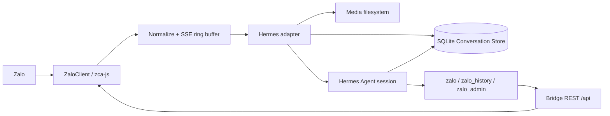

# Tổng quan hệ thống trợ lý công ty Hermes trên Zalo

Ngày khóa kiến trúc: 2026-08-09  
Phiên bản thiết kế: `company-assistant-v1`  
Baseline: `hermes-zalo-plugin@1.0.9`, `zca-js@2.1.2`, Hermes Agent `0.19.0`
tại commit `eb52760564dbba2e5971fa54bd67384e281cd3b8`. Plugin yêu cầu tối thiểu
hai contract `PlatformEntry.env_enablement_fn` và `MessageEvent.channel_context`;
không coi các checkout khác cùng nhãn `0.19.0` là tương thích nếu thiếu contract.

## Mục đích và phạm vi

Một tài khoản Zalo công ty kết nối tới một Hermes Agent chạy trên VPS. Năm thành viên trong `allowed_users` có thể dùng Hermes và toàn bộ bề mặt vận hành của `zca-js` ngay lập tức. Admin có thêm quyền quản trị bot, cấu hình, memory, lịch sử và dịch vụ. Không xây approval broker, mã duyệt hay phân quyền theo từng method Zalo.

## Thành phần

1. `ZaloClient` sở hữu phiên `zca-js`, QR/cookie login, reconnect, keepalive và các listener message/reaction/undo/friend/group.
2. Node bridge chỉ bind `127.0.0.1`, xác thực token nội bộ trên mọi route, chuẩn hóa event, phát SSE và gọi method live trên API object.
3. Python Hermes adapter nhận SSE, quyết định DM/group và mention, ghi Conversation Store trước khi gọi Hermes, tạo session và gửi trả lời.
4. Conversation Store dùng SQLite làm nguồn sự thật cho conversation, message, event, attachment và tool activity. Binary media nằm trên filesystem, SQLite chỉ giữ metadata/path/hash.
5. Hermes Agent cung cấp toàn bộ tool thông thường. Plugin đăng ký `zalo`, `zalo_history`, `zalo_admin` và các hook nhận diện requester.
6. Admin Guard chỉ bảo vệ thao tác quản trị bot. Hook `pre_tool_call` dùng `ContextVar` requester để chặn non-admin sửa memory chung qua mọi đường (`memory`, `write_file`, `patch`, `terminal`, `execute_code`).

## Luồng dữ liệu

### Group

Với group trong `allowed_groups`, mọi message và event được normalize, dedupe và ghi trước khi kiểm tra mention. Message không mention chỉ kết thúc tại store. Message mention từ `allowed_users` mới tạo agent turn; mention từ người ngoài vẫn được lưu nhưng không gọi Hermes.

### DM

Chỉ DM từ `allowed_users` được ghi và gọi Hermes. Session key là một session riêng cho từng Zalo ID. DM của người khác không được đọc bởi thành viên hiện tại.

### Quyền đọc lịch sử trusted-team

Mọi thành viên trong `allowed_users` có thể tìm kiếm và đọc lịch sử của tất cả
group trong `allowed_groups`, kể cả khi đang hỏi bot từ DM hoặc group khác. Đây
là policy chia sẻ ngữ cảnh công ty có chủ đích. Thành viên không được đọc DM của
người khác, export/xóa lịch sử, đổi retention hoặc thực hiện thao tác quản trị;
các quyền liên phạm vi đó chỉ dành cho admin.

### Outbound

Mỗi câu trả lời hoặc media outbound được ghi vào store sau khi bridge trả về provider ID. Timeout/không rõ kết quả trả trạng thái `unknown` và không tự gửi lại.

### Theo dõi phản hồi nhiều ngày

`FollowUpService` dùng hai bảng trong migration `002_follow_up_tracking.sql` để
lưu yêu cầu của admin và từng target DM. Khi tạo yêu cầu, toàn bộ target được
ghi ở trạng thái `initial_sending` trước khi adapter gửi câu hỏi. Chỉ DM của
đúng `target_id`, cùng thread DM và có `sent_at` sau `initial_sent_at` mới được
ghép; message group vẫn được lưu nhưng không bao giờ hoàn thành target DM.

Adapter chạy một ticker `asyncio` nội bộ cùng process Python hiện có. Ticker chỉ
claim và gửi khi bridge/Zalo đã sẵn sàng; khi mất kết nối, deadline vẫn nằm trong
SQLite và sẽ được đọc lại sau reconnect. Mỗi claim được ghi trước network call.
Claim dở dang sau restart thành `unknown`, không tự gửi lại. Mỗi target quá hạn
chỉ nhận một reminder tự động; sau khi mọi target có outcome, report chỉ gửi vào
DM của admin tạo yêu cầu và follow-up chuyển sang `awaiting_admin`. Các admin
khác vẫn có thể dùng `zalo_admin` để xem/gia hạn/nhắc thủ công/đóng.

Workflow này không dùng Hermes cron, prompt, terminal, quét history hay file JSON
làm state nghiệp vụ và không tạo process/service mới.

## Định danh và session

- `allowed_users` là nguồn duy nhất cho quyền kích hoạt Hermes.
- `admin_users` phải là tập con của `allowed_users`; không được xóa admin cuối cùng.
- Group dùng session chung bằng `group_sessions_per_user: false` trong Hermes config.
- DM dùng session riêng mặc định của Hermes (`chat_id` là Zalo ID).
- `ContextVar` được đặt ngay trước `handle_message(event)` và mang `requester_id`, `thread_type`, `thread_id`, `is_admin` qua mọi tool call của turn. Không lấy requester từ tham số do model tự khai báo.

## Bề mặt Zalo

Bridge giữ các route tiện dụng hiện có và `POST /api/:method`. Thêm `GET /api/methods` và `GET /api/methods/:method` để `zalo(list|describe)` khám phá catalog. Catalog được tạo từ `zca-js@2.1.2` (`dist/apis/*.d.ts` và function signature runtime), nên method mới vẫn dùng được bằng positional `args` mà không cần sửa bridge.

Các method xuất credential (`getCookie`, `getContext`) và dữ liệu token/secret bị ẩn khỏi catalog, bị từ chối khi gọi và bị redact đệ quy trong kết quả/log. QR chỉ đi qua flow admin/CLI.

## Bất biến vận hành

1. Token bridge bắt buộc, truyền bằng `Authorization: Bearer` (header `x-bridge-token` chỉ để tương thích nội bộ), không nhận token qua query string.
2. Mọi route, kể cả `/health`, `/events`, `/qr`, đều yêu cầu token.
3. Event/message dedupe là no-op ở lần thứ hai; duplicate không gọi Hermes và không tải media lại.
4. Store lỗi thì event hợp lệ không được gọi Hermes.
5. Media tối đa `20 MiB` được tải; stream vượt cap dừng và giữ metadata-only.
6. Credential không xuất hiện trong chat, journal hay `tool_activity`.
7. Mọi file tạo/sửa/xóa phải có trong `docs/architecture/file-manifest.md` trước khi thay đổi.

## Điều không làm

Không hỗ trợ multi-tenant, Official Account API, approval broker, policy theo phòng ban, audit chống sửa đổi cho tuân thủ pháp lý, hoặc cam kết tránh việc tài khoản cá nhân bị Zalo hạn chế.
