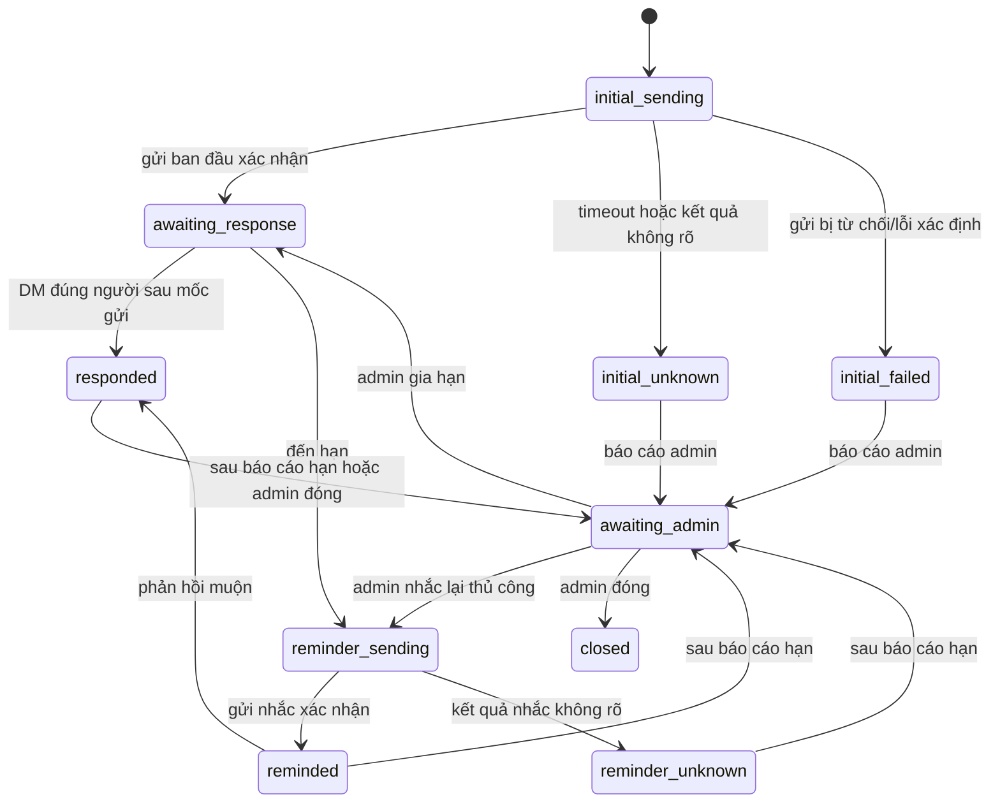

# Thiết kế theo dõi phản hồi Zalo nhiều ngày

**Ngày:** 2026-08-13  
**Trạng thái:** Đã duyệt triển khai; kế hoạch TDD: `docs/superpowers/plans/2026-08-13-hermes-zalo-follow-up-tracking.md`
**Phạm vi:** Hermes Zalo Company Assistant

## 1. Vấn đề thực tế

Trong bài thử Tiny và Tí Nị, bot đã tạo một cron job rồi để model tự đọc lịch
sử sau hai phút. Cách đó có ba lỗi:

1. Cron không có `Requester` Zalo nên `zalo_history` bị fail-closed.
2. Cron lọc theo `sender_id`, do đó có thể nhầm tin trong group là phản hồi cho
   một câu hỏi gửi riêng.
3. Cron và outbound gửi trực tiếp không có một hồ sơ nghiệp vụ bền vững để biết
   ai đã được hỏi, lúc nào, vào DM nào, đã nhắc chưa và đã báo cáo ai.

Việc theo dõi có thể kéo dài nhiều ngày. Vì vậy nó không được dựa vào trí nhớ
của model, prompt cron, terminal hay việc quét lại toàn bộ hội thoại.

## 2. Mục tiêu và chính sách đã chốt

Admin có thể giao cho bot hỏi một hoặc nhiều thành viên allowlist bằng DM, rồi
theo dõi từng phản hồi đến một thời điểm hạn cụ thể.

- Mỗi mục tiêu được ràng buộc bằng đúng `target_id`, đúng DM và thời điểm bot
  đã gửi câu hỏi.
- Chỉ tin inbound trong DM của đúng người, xuất hiện sau thời điểm gửi câu hỏi,
  mới có thể trở thành phản hồi. Tin trong group không bao giờ được tính.
- Đến hạn, bot chỉ nhắc **một lần** cho từng người chưa phản hồi.
- Sau khi nhắc, bot gửi một báo cáo vào DM của admin đã tạo yêu cầu.
- Sau báo cáo hạn, trạng thái chuyển sang `awaiting_admin`; bot không nhắc lần
  hai cho đến khi admin chủ động gia hạn hoặc yêu cầu nhắc lại thủ công.
- Nếu người đó phản hồi sau khi đã nhắc/báo cáo, trạng thái được cập nhật ngay;
  bot không gửi thêm lời nhắc tự động.
- Chỉ admin được tạo, xem toàn bộ, gia hạn, nhắc lại thủ công hoặc đóng theo
  dõi. Mục tiêu phải thuộc `allowed_users`; nếu không, yêu cầu bị từ chối ngay.
- Báo cáo mặc định chỉ gửi vào DM của admin tạo yêu cầu, không gửi vào group và
  không broadcast cho các admin khác.

Ví dụ: Admin giao việc: “Hỏi Tiny và Tí Nị có họp thứ Bảy không, hạn 17:00 thứ
Sáu.” Bot gửi DM riêng, lưu hai mục tiêu. Đến 17:00, Tiny đã trả lời “Có”; Tí
Nị chưa trả lời nên nhận đúng một lời nhắc. Bot báo DM admin: “Tiny: Có họp.
Tí Nị: chưa phản hồi, đã nhắc lúc 17:00. Đang chờ chỉ đạo.”

## 3. Phương án được chọn

### 3.1. Nguồn sự thật

Thêm migration `002_follow_up_tracking.sql`, giữ nguyên bất biến
`001_initial.sql` và checksum hiện có. Conversation Store SQLite tiếp tục là
nguồn sự thật; không tạo service/process mới và không dùng file JSON làm state
nghiệp vụ.

Hai bảng mới dự kiến:

| Bảng | Mục đích |
|---|---|
| `follow_ups` | Một yêu cầu theo dõi: admin sở hữu, câu hỏi, hạn, trạng thái hạn và trạng thái báo cáo. |
| `follow_up_targets` | Một người cần phản hồi: đúng Zalo ID/DM, gửi ban đầu, phản hồi đã ghép, nhắc một lần và outcome delivery. |

`follow_ups` tối thiểu lưu: `id`, `owner_id`, `title`, `question_text`,
`created_at`, `due_at`, `state`, `report_state`, `report_claimed_at`,
`report_sent_at`, `closed_at`.

`follow_up_targets` tối thiểu lưu: `id`, `follow_up_id`, `target_id`,
`target_name`, `state`, `initial_provider_message_id`, `initial_sent_at`,
`response_message_id`, `response_at`, `response_kind`,
`reminder_provider_message_id`, `reminder_claimed_at`, `reminder_sent_at`.

Ràng buộc bắt buộc:

- `UNIQUE(follow_up_id, target_id)`;
- foreign key từ target về follow-up với `ON DELETE CASCADE`;
- trạng thái bị giới hạn bởi `CHECK`;
- index cho mục tiêu còn chờ theo `state`/`due_at` và cho phản hồi theo
  `target_id`;
- toàn bộ timestamp là ISO-8601 UTC.

Không lưu bản sao raw hội thoại trong hai bảng; `response_message_id` tham chiếu
về bảng `messages` đã có. Điều này tránh dữ liệu trùng và giữ retention/purge
hiện hữu có hiệu lực.

### 3.2. Các trạng thái chính



`initial_unknown`, `reminder_unknown` là trạng thái không tự retry: network có
thể đã gửi thành công dù bridge không nhận được phản hồi. Admin nhìn thấy outcome
đó và quyết định thao tác tiếp theo.

## 4. Luồng xử lý

### 4.1. Tạo yêu cầu

1. Admin yêu cầu tạo theo dõi với tiêu đề, câu hỏi, danh sách Zalo ID đã biết
   và `due_at` UTC rõ ràng.
2. Tool kiểm tra admin, deadline ở tương lai và mọi ID thuộc `allowed_users`.
3. Trong SQLite, tạo follow-up và target `initial_sending` trước khi gửi bất kỳ
   DM nào.
4. Adapter gửi từng DM qua đường `ZaloAdapter.send()`, vốn đã ghi outbound vào
   Conversation Store khi provider xác nhận.
5. Target trở thành `awaiting_response`, `initial_failed` hoặc
   `initial_unknown`. Tool trả một kết quả trung thực ngay trong turn hiện tại;
   bot không được nói “đã theo dõi” nếu bản ghi không được tạo thành công.

### 4.2. Ghép phản hồi inbound

Ngay sau khi adapter lưu một inbound DM hợp lệ vào `messages`, trước khi gọi
Hermes cho turn thông thường, nó gọi `FollowUpService.record_inbound_response`.
Hàm này chỉ xét target còn mở có:

- `target_id == sender_id`;
- conversation `thread_type == 'dm'` và `thread_id == sender_id`;
- `message.sent_at > initial_sent_at`;
- trạng thái đang chờ phản hồi hoặc đã nhắc.

Nội dung được phân loại xác định: mở đầu “có” là `yes`, mở đầu “không” là `no`,
còn lại là `other`. Báo cáo giữ nguyên nội dung đã redact từ message liên kết;
không yêu cầu model suy diễn lại lịch sử. Một tin inbound được ghép tối đa một
lần cho mỗi target và update có điều kiện để event trùng là no-op.

### 4.3. Hạn, nhắc một lần và báo cáo

Adapter tạo một `asyncio` ticker nội bộ khi nó kết nối; đây không phải service
mới. Ticker thức dậy theo chu kỳ ngắn, đọc state SQLite và khi gateway restart
sẽ tiếp tục xử lý các mục tiêu quá hạn.

Ticker chỉ claim công việc khi bridge đang sẵn sàng và Zalo đã đăng nhập. Với
mỗi follow-up đến hạn:

1. Claim atomically target `awaiting_response` thành `reminder_sending`.
2. Gửi đúng một DM nhắc; ghi `reminded`, `reminder_failed` hoặc
   `reminder_unknown`, không retry tự động.
3. Khi tất cả target đến hạn đã có outcome, claim report một lần, tạo báo cáo
   từ state SQLite và gửi DM cho `owner_id`.
4. Ghi `report_sent` hoặc `report_unknown`; sau đó follow-up chuyển sang
   `awaiting_admin`.

Để tránh gửi trùng sau crash, mọi claim được ghi trước network call. Nếu process
chết sau khi claim nhưng trước khi biết kết quả, recovery chuyển claim dở dang
thành outcome `unknown`, không gửi lại.

### 4.4. Quyết định của admin sau hạn

Admin có các hành động rõ ràng:

- `follow_up_status`: xem từng người và outcome.
- `follow_up_extend`: đặt hạn mới cho các target chưa phản hồi; không đổi lịch
  sử phản hồi cũ.
- `follow_up_remind`: nhắc lại thủ công các target được chỉ định; đây là thao
  tác do admin chủ động, không khôi phục nhắc tự động lặp lại.
- `follow_up_close`: đóng theo dõi; các tin sau đó không còn bị ghép vào nó.

## 5. Bề mặt tool và ranh giới quyền

Mở rộng `zalo_admin`, không mở generic Zalo API mới:

```json
{
  "action": "follow_up_create",
  "title": "Xác nhận họp thứ Bảy",
  "question": "Bạn có tham gia họp sáng thứ Bảy không?",
  "targets": [
    {"zalo_id": "6906520402993817174", "name": "Tiny"},
    {"zalo_id": "5189400998311849354", "name": "Tí Nị"}
  ],
  "due_at": "2026-08-14T10:00:00Z"
}
```

`follow_up_create`, `follow_up_status`, `follow_up_extend`,
`follow_up_remind` và `follow_up_close` đều là admin-only, dùng `Requester`
đang bind từ event, không tin `owner_id` do model cung cấp. `owner_id` luôn là
admin đã gọi tool. User thường không đọc, tạo, sửa hoặc đóng follow-up của người
khác.

Không dùng `zalo_history` hay terminal trong cron. Hermes cron có thể vẫn tồn
tại cho chức năng khác, nhưng không được dùng làm nguồn state hoặc bộ phân tích
phản hồi của workflow này.

## 6. Hành vi lỗi và khôi phục

- Bridge/session chưa sẵn sàng: giữ mục tiêu đến hạn ở hàng đợi bền vững, không
  đánh dấu đã nhắc; ticker thử lại khi bridge phục hồi trước khi claim gửi.
- Provider timeout sau claim: outcome `unknown`, không tự gửi lại; báo cáo admin
  nêu rõ không rõ kết quả.
- Gửi report timeout: `report_unknown`; không lặng lẽ lặp lại, admin có thể xem
  trong Admin Web/log/tool status.
- Restart gateway: ticker đọc lại bản ghi `active`; mục tiêu chưa claim được xử
  lý khi có kết nối; claim dở dang trở thành `unknown`.
- Purge history: không được xóa follow-up còn mở. Khi admin xóa message phản hồi
  đã liên kết, status follow-up giữ outcome và hiển thị rằng tham chiếu history
  không còn, thay vì gán lại phản hồi khác.

## 7. Phạm vi file dự kiến khi triển khai

Trước khi tạo/sửa, các path sau phải được đăng ký vào
`docs/architecture/file-manifest.md` trong cùng thay đổi:

- Tạo: `hermes-plugin/migrations/002_follow_up_tracking.sql`
- Tạo: `hermes-plugin/follow_up.py`
- Tạo: `tests/python/test_follow_up.py`
- Sửa: `hermes-plugin/history_store.py`
- Sửa: `hermes-plugin/adapter.py`
- Sửa: `hermes-plugin/admin.py`
- Sửa: `hermes-plugin/tooling.py`
- Sửa: `tests/python/test_history_store.py`
- Sửa: `tests/python/test_adapter.py`
- Sửa: `tests/python/test_tooling.py`
- Sửa: `tests/integration/test_company_assistant_flow.py`
- Sửa: `docs/architecture/system-overview.md`
- Sửa: `docs/architecture/database-schema.md`
- Sửa: `docs/operations/acceptance-checklist.md`

Không đổi Node bridge, generic Zalo catalog, `001_initial.sql`, API Admin Web
hiện có, process/service systemd hoặc policy nhóm/DM hiện hành.

## 8. Tiêu chí nghiệm thu

1. Test tái hiện: tin nhóm của Tiny không thể hoàn thành follow-up DM của Tiny.
2. Một DM hợp lệ sau `initial_sent_at` hoàn thành đúng target và không nhắc lại.
3. Đến hạn, mỗi target chưa phản hồi chỉ nhận một lời nhắc tự động.
4. Report chỉ đến DM của admin tạo follow-up, có trạng thái `Có`, `Không`,
   `Đã phản hồi khác`, `Chưa phản hồi`, `gửi lỗi` hoặc `không rõ kết quả`.
5. Restart giữa claim/gửi không tạo duplicate outbound; outcome là success,
   failure hoặc unknown rõ ràng.
6. Non-admin không gọi được mọi action follow-up; target ngoài allowlist bị từ
   chối trước khi gửi.
7. Static acceptance, Node, Python, integration suite và `git diff --check`
   đều pass; migration `001` vẫn có SHA-256
   `1bc42abea11f4480d7a513cb4ddd2ee9d6986d1449d5a939aed14e59c161e42a`.
